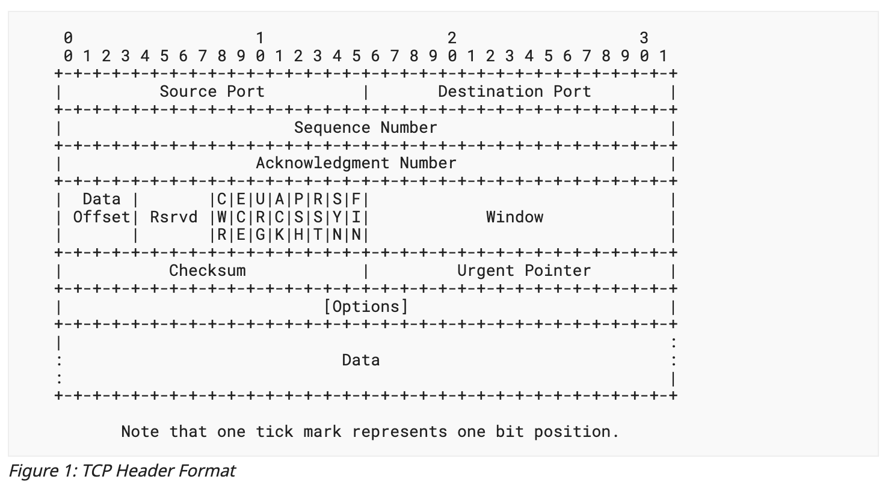
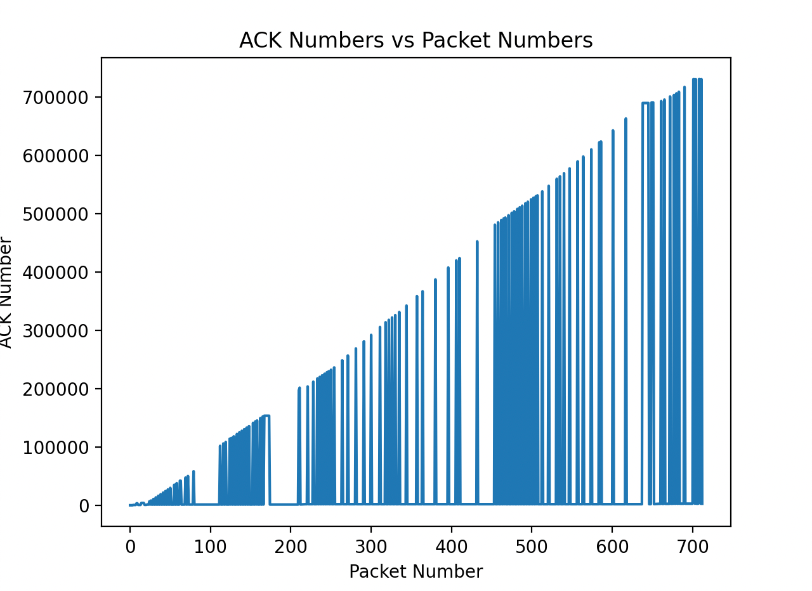

# 2023 Spring CS305 PA2: Packet Analyzer

## Changelog

**April. 23** 

   The version released in `Sakai`

**April. 24**

1. Fixed some descriptions on *HTTP* *Analyzer* Part
2. Descriptions added on submission format.
3. Fixed some typos in document
4. Fixed an error of calculation in grader

**April. 25**

1. References on `scapy` added, thanks to [Yan-Ice](https://github.com/Yan-ice)
2. Clarified a sentence that is easily misunderstood
3. Clarified standard on additional libraries

**April. 26**

1. Clarified a sentence on format of output to correspond to example files
1. Fixed some typos

## Introduction

Analyzing TCP traffic is a crucial skill in computer networking, as it allows us to understand how applications communicate over the network, identify performance issues and security threats, and optimize network configurations. The TCP stream analyzer that we will be introducing in this assignment is a key tool for achieving these objectives, as it will enable you to extract important information from TCP packets, such as sequence and acknowledgement numbers, payload data, and performance statistics. By the end of this assignment, you should have a solid understanding of how TCP stream analysis works. In this assignment, you should implement a TCP stream analyzer using `Python` and the `scapy` library. **A GitHub repository** of this assignment is referred, as [here](https://github.com/ensomnia16/CS305-23S-Assignment2). **We will update document and code in the GitHub page (please keep track of this page)**, and you can also raise your issues, questions, and any confusion about this assignment in this page. Issues raised in other ways will be responded in a secondary priority.

**Submit:**

You need to submit a report in PDF, and your code implementation of `pkt_analyzer.py`. The report should contain at least the following parts:

1. Screenshot of the grader. The screenshot should contain your `TOKEN`, and your scores.
2. Anything you want to tell us about Task 2, at least one figure as well as your explanation.

Do not submit your files in one compress file. Submit them separately in Sakai. **We will not accept any late submission, and score reduction might be assumed if not submitted in the given way.**

Thanks to [Yan-Ice](https://github.com/Yan-ice), here are some references for `scapy`: [Official website](https://scapy.net/), [Documentation](https://scapy.readthedocs.io/en/latest/), [Github Repo](https://github.com/secdev/scapy)

You can directly use the `pcap` files we provided, although you are suggested to catch your own `pcap` files and test your code with it.

You are **not allowed** to use additional libraries, apart from those in `requirements.txt` and `scapy` or plotting-related libraries like `matplotlib`, `numpy` , `pandas`, etc.

## Environment Setup

In this assignment, you are suggested to use `Python 3.11`, as we will test your code in this environment. You also need to install a few libraries. With anaconda, you can do this by the following command in shell

```zsh
conda create -y -n PA2 python=3.11 && conda activate PA2 && pip install -r requirements.txt
```

**MAKE SURE** that when running this command, the `PWD` must contain all the files needed by test. To check this, run command

```zsh
ls
```

and make sure the output contains these files:

```
RENAME_TO_SID.GRADER
pkt_analyzer.py
TCP_PKTS.pcap
HTTP_.pcap
PACKET_INFO.txt
requirements.txt
```

You can also manually install each library by `pip`. The required libraries are listed in `requirements.txt`.

Remember that these files are essential for grading scripts and do not modify them or rename them.

**We have provided a skeleton file called `pkt_analyzer.py`. Please implement your code in this file, and do not modify the functions and the corresponding parameter lists.**

## Requirements

### Task 1 (85 pts)

In this task, you need to implement a simple TCP packet analyzer, which can be used to do:

#### TCP Connection Analyzer (10 pts)

Extract all TCP connections in a `pcap` file, print them, and save them into a `txt` file in the format of

```
/*Src. IP*/:/*Src. Port*/ -> /*Dst. IP*/:/*Dst. Port*/
```

Note that you only need to implement `IPv4/TCP` in this part , i.e., you do not need to handle `IPv6` packets in this part. Make sure to output connection in time order. If you use the code skeleton, it should be easy to do.

**Tips for this part**

- Note the difference of stream and connection. In this assignment you may assume that streams are specified by `(server address, client address, server port, client port)` and connections are specified by `(dst address, src address, dst port, src port)`. This may be slightly different with the precise definition of stream and connection in textbook.
- There are multiple packets in a single connection.
- If you are confused about the output format of `txt` file, please refer to the `PACKET_INFO.txt`.

#### TCP Stream Analyzer (45 pts)

According to [RFC9293](https://www.ietf.org/rfc/rfc9293.html), there are multiple fields in the headers of a TCP segment:



1. Group all the packets belonging to the same TCP stream in the `pcap` file, and save them into a `txt` file. The TCP stream is specified with a four-element tuple, defined in function parameter. You should tell the sequence number of the packet. You should also tell which packet belongs to the client (sent by the client), and which belongs to the server.
2. Calculate relative `ACK` and `SEQ` numbers, correctly. You must have learnt the definitions of relative `ACK` and `SEQ`, so detailed information about them are omitted for brevity.
3. You should also label flags (control bits: `ACK`, `SYN`, `FIN`, etc.) in `TCP` packets.

and the line is in the format of, if the sender is the server and receiver is client:

```
Server -> Client Num: /*Packet Number*/, SEQ: /*SEQ NUM*/, ACK: /*ACK NUM*/ /*FLAGS*/
```

otherwise if the sender is the client and receiver is server:

```
Client -> Server Num: /*Packet Number*/, SEQ: /*SEQ NUM*/, ACK: /*ACK NUM*/ /*FLAGS*/
```

Besides each packet, you are also requested to save these properties into the `txt` file, in the first line of the file, in the format of

```
Server : /*Server. IP*/:/*Serevr. Port*/ <-> Client : /*Client IP*/:/*Client Port*/
```

**Tips for this part**

- Client is the initiator of a `TCP` connection, i.e., the sender of the first packet of a `TCP` stream.
- Note the difference between connections and streams for this assignment.
- If you are confused about the output format of `txt` file, please refer to the `TCP_examples.txt`.

#### IPv6 (10 pts)

Handle IPv6 packets. You should implement your packet analyzer to handle `TCP` carried by `IPv6` packets. After implementation, your pkt analyzer should be able to read out `IPv6` packets and analyze `TCP` streams containing `IPv6` packets. The output format is the same as that in **TCP Stream Analyzer** part.

**Tips for this part**

- For `IPv4` packet, you can simply use `packet['IP']` to extract. What about `IPv6` packet?
- If you are confused about the output format of `txt` file, please refer to the `IPv6_examples.txt`.

#### HTTP Analyzer (20 pts)

Decode `HTTP/1.1` stream. Please decode the HTTP in the format of

```
METHOD URL PROTOCAL_VERSION
```

```
PROTOCAL_VERSION STATUS_CODE STATUS
```

You only need to implement `HTTP/1.1`. You do not need to implement `HTTPS`. You are guaranteed that when testing this part, a `.pcap` that contains only `HTTP` packets will be provided. For those packets which does not have an HTTP header but does belong to an HTTP stream, you should use

```
..NO HEADER..
```

to indicate. Those packets without headers may be due to the segmentation of `TCP`, which segments one complete `HTTP` message into multiple `TCP` segments.

**Tips for this part**

- For application layer, i.e., the payload of `TCP` layer, you should note that directly using `packet['HTTP']` may not be a proper way since `scapy` is unable to tell the protocol of the payload of `TCP` packets. Use `packet['TCP'].payload` instead.
- If you are confused about the fields and members of `packet` object in `scapy`, you can try `breakpoint` and use `debugger` to observe members and status of your code, as well as `packet` object. Or you can turn to official documents for references.
- Exceptions may occur if encountered `HTTP` packets without `HTTP Header`. Handle it using `try...except` block.
- If you are confused about the output format of `txt` file, turn to `HTTP_examples.txt`.

**There are three example `txt` files to demonstrate correct format of output of your program.** If you are confused, carefully check them to make sure you understand the idea. They are stored in `Examples` folder.

### Task 2

#### TCP Behaviour Demonstration (15 pts)

You may use `wireshark`, `tcpdump` or alike tools to capture packets and store your own `pacp` file to analyze `TCP` streams.

Use the packet analyzer programmed by you to demonstrate some behaviors of TCP stream, including:

1. RENO-TCP Fast Recovery
2. Slow Start
3. Round Trip Time

The demonstration methods must include at least one figure automatically plotted by `matplotlib` or other plotting libraries. Note that you are **not allowed** to submit a figure plotted by **hand-making data**, like plotted by `excel` or any other alike tools. You have to **specificate** (submit) the code clip you used to plot figures in your report. You must **clearly indicate** which part of the figure tells which TCP behavior and explain reasons, otherwise you will **lose at least 10 pts for this part**. Note that you do not need to demonstrate all behaviours, any one of them is sufficient. Also, it is not worth to spend time on making your plots look fancy (this does not help you to get higher grades). A simple example figure tells the relationship between ACK Numbers and Packet Numbers for a TCP stream is provided as follows



The code to plot this figure is (suppose you have stored ACK numbers in list `ackss`)

```python
import matplotlib.pyplot as plt

# Create x-axis values (just the index of each ACK)
x_values = list(range(len(ackss)))

# Plot the line chart
plt.plot(x_values, ackss)

# Add x and y labels and a title
plt.xlabel('Packet Number')
plt.ylabel('ACK Number')
plt.title('ACK Numbers vs Packet Numbers')

# Show the plot
plt.show()
```

Note that this figure is just for an example, you may find more fine plot to demonstrate besides ACKnum v. PacketNum figure (i.e., the example figure).

## Grading Rules

For Task 1, a script file will be provided. To use this script, you have to use `Python 3.11` environment. You can use

```zsh
python *your_sid*.GRADER
```

to run grader script. Make sure to **submit the screenshot** of it in your report, or your grade for this part may be lost. Do not try to modify the answer txt. BIG BROTHER IS WATCHING YOU. Do not forget to rename the filename of your script to your student ID.

For Task 2, you have to demonstrate behaviors of TCP streams, using a code clip to plot arguments of a `TCP` packet. You must **clearly indicate which behavior is presented**, **explain reasons**, and give your code to do plotting.

## Step by step Tutorial

In this assignment you are required to use `scapy` library to decode packets saved in a `.pcap` file. In task 1, you can only use `pcap` file provided by us. Usage of `scapy` is very easy.

```python
def packet_info(pcap_file, save_file):
    # Open the pcap file
    packets = rdpcap(pcap_file)

    # Loop through all packets in the pcap file
    with open(save_file, 'w') as f:
        for packet in packets:
            # Check if the packet is an IPv4 packet
            f.write("{}:{} -> {}:{}\n".format(packet['IP'].src, packet['TCP'].sport, packet['IP'].dst,packet['TCP'].dport))
```

You can simply use `packet['TCP']` to access the `TCP` layer of the packet.
